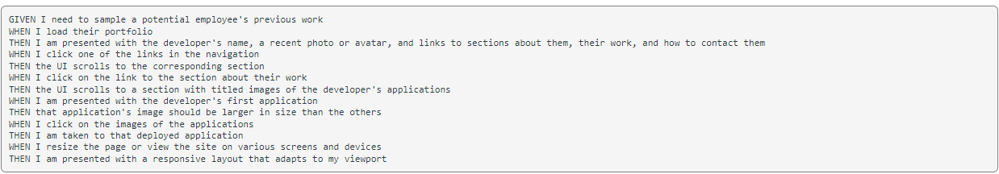

# <Mod Two Challenge>

## Description

For this project we are tasked in creating our own portfolio page as a means to put future projects, employment history, and contact about us.
Personalizing it to our liking.

At the same time learn how to properly scale and response our pages in different device and width, whilst some good understanding of how to linking to different parts of the page.

Here is the following requirements for the page

## What I Did for My Portfolio 

Although the challenge gave us a template to try and replicate shown below:

# My Version

I decided to somewhat go my own way, as we were told it was okay and I approached this in a much more minimalistic but stylish way: 

For this project I turned the header into a static video and the static project or work section as a animated scrolling video.

## Issues With This Project

* I spent 6-8 hours of just working the header. Restructuring the video background and changing it to suit a sort of taste I can like. Even compiling free stock videos 

## Link To Static Page

https://mambrocio.github.io/chal-oneMod/